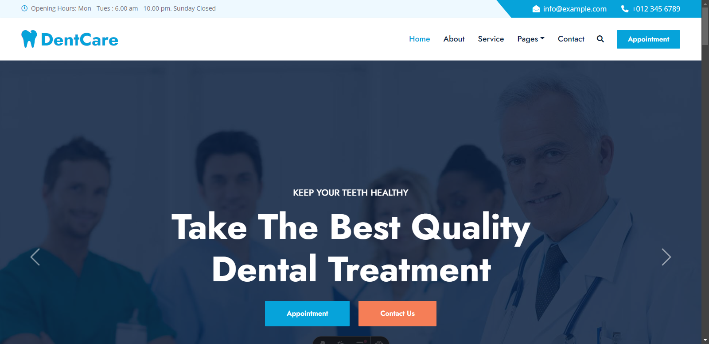
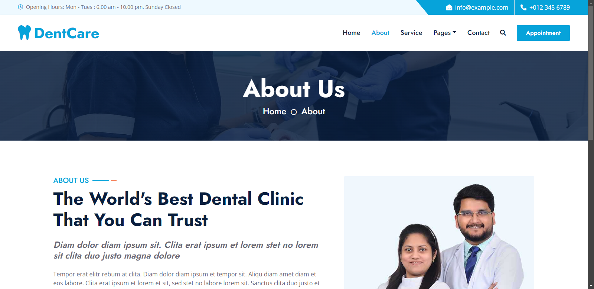
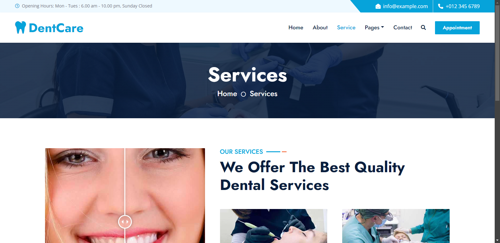
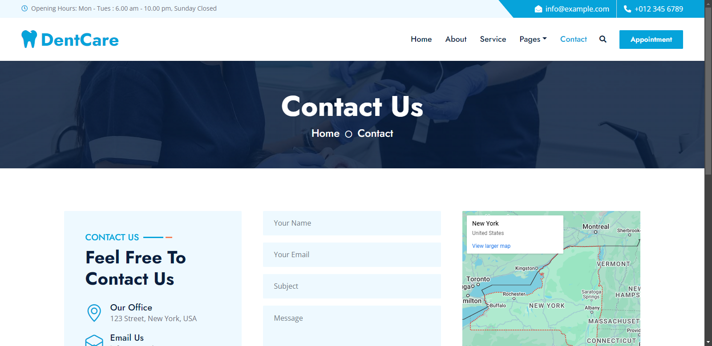

# Clinic Web Template


[](https://astro.build)
[](https://getbootstrap.com/)

To run the project, clone this repository and run the following command:

```sh
npm run dev
```
This is a website general template for a clinic, with the following pages:

## 🏠 HOME


This section has all the information about the clinic, such as the services offered, the team, and the contact information.

## 💁‍♂️ ABOUT


This section displays all the details about the clinic, such as the history, the team, and the services offered.

## 📝 SERVICE


This section displays all the services offered by the clinic, such as consultations, exams, and specialties.

## 📱 CONTACT


This section displays the contact information of the clinic, such as the address, phone number, and email.

The template has a responsive design and some other pages and components that add fuctionality to the website.

This is a work in progress, so there are still many features to be implemented.

You can find the free web template used in this project [here](https://htmlcodex.com/).